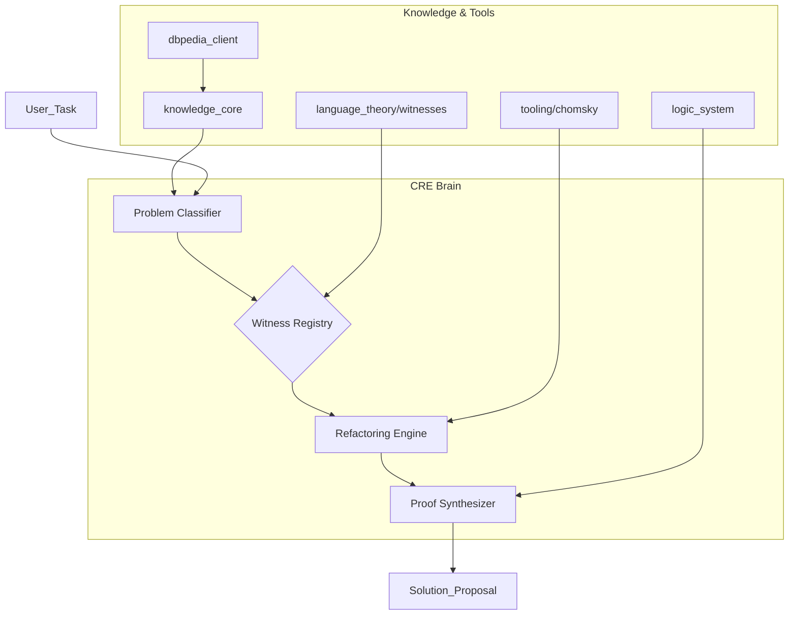
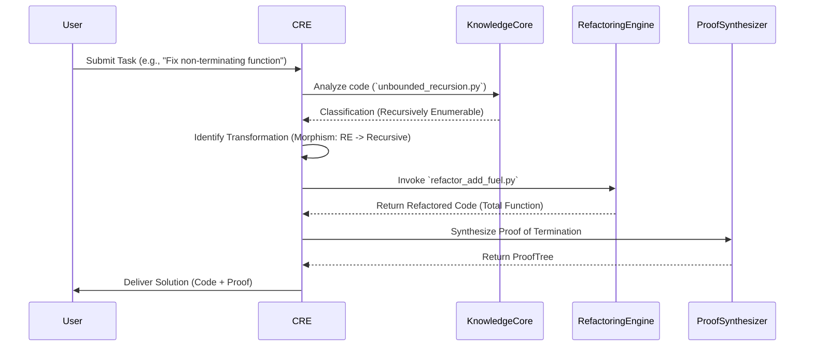

# Formal Specification: The Categorical Reasoning Engine (CRE)

This document provides a formal specification for a non-LLM-based agent brain, hereafter referred to as the Categorical Reasoning Engine (CRE). The CRE is designed to reason about and solve problems by mapping them onto the formal, categorical structure of computation defined in `language_theory/THEORY.md`.

## 1. Conceptual Model

The CRE operates on the principle that software development tasks (bug fixing, refactoring, implementation) can be understood as transformations within a formal space of computational complexity. Instead of relying on natural language understanding, the CRE classifies problems, selects appropriate "executable witnesses" (programs, proofs), and applies formal transformations (refactorings) to generate solutions.

### 1.1. Architecture Diagram

The following diagram illustrates the high-level architecture of the CRE:

### 1.2. Core Components

*   **Problem Classifier:** This is the entry point. It ingests a user task and associated code artifacts. It uses the `knowledge_core` (symbol maps, dependency graphs) to analyze the code and classifies the problem into a formal category from the Chomsky Hierarchy (e.g., "unbounded recursion problem, class: Recursively Enumerable").
*   **Witness Registry:** This component acts as the CRE's "toolbox." It maintains a catalog of all available "witnesses"—the grammars, programs, and logical systems within the repository. Each witness is mapped to a specific language class and has a known complexity profile.
*   **Refactoring Engine:** This engine is responsible for applying formal transformations to code. It uses the tools in the `tooling/chomsky/` directory to perform "decidable refactoring," which involves transforming a program from one complexity class to another (typically a less complex, more decidable one).
*   **Proof Synthesizer:** This component constructs formal proofs of correctness for the solutions generated by the CRE. It uses the `logic_system` to build a `ProofTree` that demonstrates a solution's properties (e.g., termination). The generated code itself serves as the "executable witness" for this proof.
*   **Knowledge Graph Interface:** This component provides the CRE with access to the `knowledge_core` and external knowledge sources via the `dbpedia_client`.

## 2. Formal Description of the Reasoning Process (The Cognitive Cycle)

The CRE's reasoning process is a structured, multi-stage "Cognitive Cycle" that moves a problem from initial analysis to a proven solution.

### 2.1. Cognitive Cycle Diagram

### 2.2. Stages of the Cognitive Cycle

1.  **Categorization:** The CRE receives a task. It uses the `Context Awareness Scanner` to analyze the relevant code. The `Problem Classifier` then maps the code's structure (e.g., presence of unbounded `while` loop) to a class in the Chomsky Hierarchy. The problem is formally categorized (e.g., "Refactor from RE to Recursive to ensure termination").
2.  **Witness Selection:** The `Witness Registry` identifies the current code as a "witness" for a Type-0 grammar. The target state is identified as a "witness" for a `Recursive` language (a decider that is guaranteed to halt).
3.  **Morphism Identification:** The CRE consults the categorical diagram in `THEORY.md`. It identifies a "morphism" (a refactoring path) between the source and target classes. This morphism corresponds to a specific strategy, such as "Decidable Refactoring." The CRE then selects the tool that implements this morphism (e.g., `refactor_add_fuel.py`).
4.  **Transformation:** The `Refactoring Engine` is invoked with the selected tool and the target code. The code is transformed into a new state (e.g., a function with a "fuel" parameter that is now a total function).
5.  **Proof Synthesis:** The `Proof Synthesizer` is engaged to formally prove the properties of the new code. For a termination problem, it would construct a proof of termination by induction on the "fuel" parameter.
6.  **Solution Generation:** The final output is a comprehensive, formal proposal. It includes the transformed code, the formal proof of its correctness, and a diagram illustrating the transformation within the `LangStruct` category.

## 3. Extensibility

The CRE's architecture is designed to be highly extensible.

*   **Adding New Witnesses:** A new computational paradigm (e.g., a new type of grammar or logic) can be added by creating a new "witness" file in `language_theory/witnesses/`. The `Witness Registry` will automatically discover and catalog it.
*   **Adding New Refactorings:** A new refactoring technique can be added by creating a new tool in the `tooling/` directory. A corresponding "morphism" must be defined in a protocol file, linking the tool to a specific transformation in the `LangStruct` category.
*   **Adding New Logics:** A new logical calculus (e.g., modal logic) can be integrated by adding a new module to the `logic_system/` that implements the `Rule` and `ProofTree` interfaces. The `Proof Synthesizer` can then be configured to use this new logic for relevant problem classes.

This formal, extensible, and non-LLM-based approach provides a robust foundation for building a highly specialized and maximally extensible agentic model.
