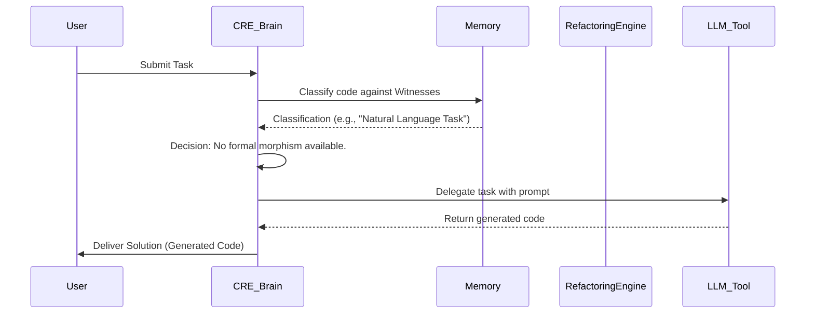

# Formal Specification: The Categorical Reasoning Engine (CRE)

This document provides a formal specification for a non-LLM-based agent brain, hereafter referred to as the Categorical Reasoning Engine (CRE). The CRE is designed to reason about and solve problems by mapping them onto the formal, categorical structure of computation defined in `language_theory/THEORY.md`.

## 1. Conceptual Model: The Brain-Memory-Tool Architecture

The CRE operates on the principle that software development tasks can be understood as formal transformations within a categorical space. The architecture is strictly divided into three components, reflecting a clear chain of authority and trust.

### 1.1. Architecture Diagram

```mermaid
graph TD
    subgraph The Brain (Formal, Deterministic Kernel)
        A[Problem Classifier] --> B{Morphism & Tool Registry};
        B --> C[Decision Engine];
        C -- Formal Path --> D[Refactoring Engine];
        D --> E[Proof Synthesizer];
    end

    subgraph The Memory (Trusted, Static Knowledge)
        F[knowledge_core/witnesses] --> A;
        G[knowledge_core/protocols] --> C;
    end

    subgraph The Tools (Untrusted, External Oracles & Actuators)
        H[tooling/llm_service.py]
        I[tooling/file_system.py]
    end

    B --> C;
    C -- Tool Path --> H;

    User_Task --> A;
    E --> Solution_Proposal;
    H --> Solution_Proposal;

```

### 1.2. Core Components

#### The Brain: Core Reasoning & Control

The "Brain" is the LLM-free, deterministic, and formal reasoning kernel. It is the sole source of authority and decision-making.

*   **Problem Classifier:** Ingests a task and uses the `WitnessRegistry` (from Memory) to classify the associated code into a formal category from the Chomsky Hierarchy.
*   **Morphism & Tool Registry:** A unified registry that catalogs both formal transformations (morphisms) and external capabilities (tools), discovered from Memory.
*   **Decision Engine:** The core of the agent's cognitive cycle. It queries the registry to decide the correct path:
    1.  Prefer a formal, verifiable transformation (morphism) if one exists.
    2.  If not, delegate to an untrusted external tool.
*   **Refactoring Engine:** Executes the formal transformation morphisms.
*   **Proof Synthesizer:** The formal verification component. It uses the `Correspondence Functor` to map the refactored code's language class to its corresponding logical system in `CatLog` and generates a formal proof of its properties.

#### The Memory: The Agent's Constitution

The "Memory" is the agent's self-contained, trusted, and static knowledge base. It is the source of the Brain's understanding of itself and its capabilities.

*   **Witness Registry (`knowledge_core/witnesses`):** The formal definitions of the "objects" (language classes) in our category, `CatFormLang`.
*   **Morphism Registry (`tooling/refactor.json`):** The formal definitions of the "morphisms" (refactoring tools) that transform objects in `CatFormLang`.
*   **Tool Registry (`tooling/tool.json`):** The formal definitions of the agent's external, non-deterministic capabilities.
*   **Protocols (`protocols/`):** The agent's core charter and rules of engagement.

#### The Tools: The Agent's Hands and Senses

"Tools" are the external, sandboxed, and untrusted components that the Brain can choose to call. They have no authority and are the agent's sole interface to the non-deterministic outside world.

*   **LLM Service (`tooling/llm_service.py`):** An oracle for tasks requiring natural language understanding or creative code generation.
*   **File System Actuators:** Tools for interacting with the file system.
*   **Human Interface:** Tools for communicating with a human operator.

## 2. The Cognitive Cycle: A Formal, Decision-Making Process

The CRE's reasoning process is a structured "Cognitive Cycle" that moves a problem from initial analysis to a proven or delegated solution.

### 2.1. Cognitive Cycle Diagram



This formal, extensible, and correctly-architected approach provides a robust foundation for a truly autonomous and anti-fragile agent.
